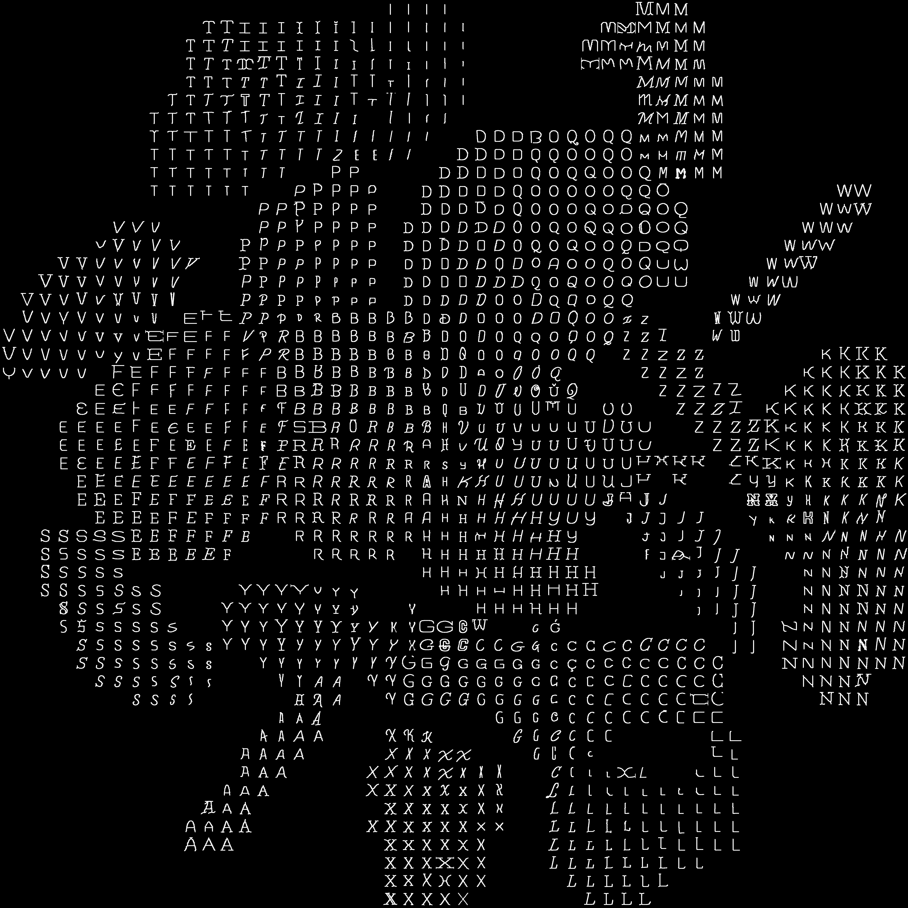

# Skeleton Autoencoder

This repo contains an implementation of the algorithm described in the paper, "Using Autoencoders to Generate Skeleton-Based Typography" presented at EvoMUSART 2023.

Project website: [CDV Website](https://cdv.dei.uc.pt/autoencoders-to-generate-skeleton-based-typography/)


## Installation

This project has been tested with Ubuntu 18.04. If you're installing on another operating system, you may encounter issues.

1. The first step is to install the [diffvg project](https://github.com/lmagoncalo/diffvg). We used a simplified version of the original project in order to remove the issues regarding the Tensorflow, as we are not using it in this project. 
	```
	git clone https://github.com/lmagoncalo/diffvg
	cd diffvg
	git submodule update --init --recursive
	conda install -y pytorch torchvision -c pytorch
	conda install -y numpy
	conda install -y scikit-image
	conda install -y -c anaconda cmake
	conda install -y -c conda-forge ffmpeg
	pip install svgwrite
	pip install svgpathtools
	pip install cssutils
	pip install numba
	pip install torch-tools
	pip install visdom
	python setup.py install
	```
2. Then extract the dataset.zip to extract our custom dataset into your environment.
3. Run the main.py file to train the models.
4. Finally, run the latent_exploration.py file to create a similar image to the following one to visualise the learned latent space of the trained Autoencoder.


## Issues
If you encounter any issues please forward them to lgoncalo(at)dei.uc.pt
